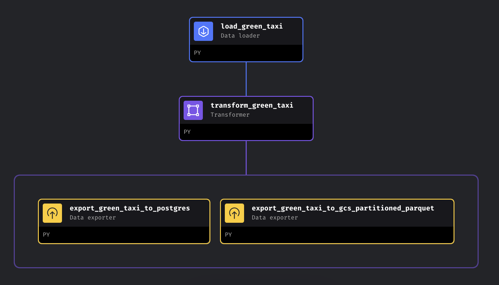
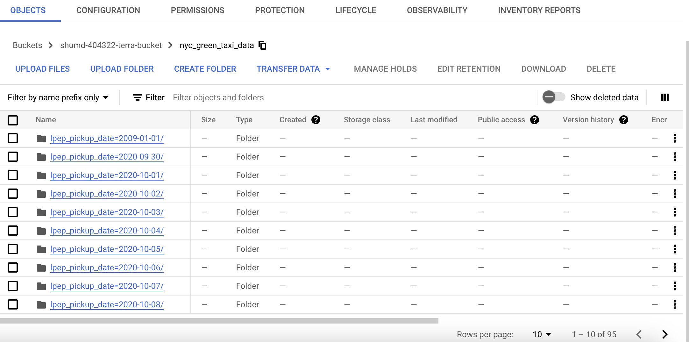

# Setup



## Step 1: Load Green Taxi Data
```python 
# load_green_taxi.py

import io
import pandas as pd
import requests
if 'data_loader' not in globals():
    from mage_ai.data_preparation.decorators import data_loader
if 'test' not in globals():
    from mage_ai.data_preparation.decorators import test


@data_loader
def load_data_from_api(*args, **kwargs):
    """
    Template for loading data from API
    """
    urls = [
        'https://github.com/DataTalksClub/nyc-tlc-data/releases/download/green/green_tripdata_2020-10.csv.gz',
        'https://github.com/DataTalksClub/nyc-tlc-data/releases/download/green/green_tripdata_2020-11.csv.gz',
        'https://github.com/DataTalksClub/nyc-tlc-data/releases/download/green/green_tripdata_2020-12.csv.gz'
    ]
    
    
    taxi_dtypes = {
        'VendorID': pd.Int64Dtype(),
        'passenger_count': pd.Int64Dtype(),
        'trip_distance': float,
        'RatecodeID':pd.Int64Dtype(),
        'store_and_fwd_flag':str,
        'PULocationID':pd.Int64Dtype(),
        'DOLocationID':pd.Int64Dtype(),
        'payment_type': pd.Int64Dtype(),
        'fare_amount': float,
        'extra':float,
        'mta_tax':float,
        'tip_amount':float,
        'tolls_amount':float,
        'improvement_surcharge':float,
        'total_amount':float,
        'congestion_surcharge':float
    }

    # native date parsing 
    parse_dates = ['lpep_pickup_datetime', 'lpep_dropoff_datetime']

    data = []
    for url in urls: 
        data.append(
            pd.read_csv(
            url, sep=',', compression='gzip', dtype=taxi_dtypes, parse_dates=parse_dates
            )
        )
    return pd.concat(data)


@test
def test_output(output, *args) -> None:
    """
    Template code for testing the output of the block.
    """
    assert output is not None, 'The output is undefined'

```

## Step 2: Tranform Green Taxi Data
```python
# transform_green_taxi.py 

if 'transformer' not in globals():
    from mage_ai.data_preparation.decorators import transformer
if 'test' not in globals():
    from mage_ai.data_preparation.decorators import test


@transformer
def transform(data, *args, **kwargs):
    """
    Template code for a transformer block.

    Add more parameters to this function if this block has multiple parent blocks.
    There should be one parameter for each output variable from each parent block.

    Args:
        data: The output from the upstream parent block
        args: The output from any additional upstream blocks (if applicable)

    Returns:
        Anything (e.g. data frame, dictionary, array, int, str, etc.)
    """
    # Specify your transformation logic here
    data.rename(columns={
        'VendorID': 'vendor_id',
        'RatecodeID': 'rate_code_id',
        'PULocationID': 'pu_location_id',
        'DOLocationID': 'do_location_id',
    }, inplace=True)

    data['lpep_pickup_date'] = data['lpep_pickup_datetime'].dt.date

    print(data.columns)

    cnt = data['passenger_count'].isin([0]).sum()
    print(f'Preprocessing: rows with zero passenger {cnt}')

    cnt = data['trip_distance'].isin([0]).sum()
    print(f'Preprocessing: rows with zero trip_distance {cnt}')

    cnt = list(data['vendor_id'].unique())
    print(f'Preprocessing: unique vendor_id {cnt}')

    mask_passenger = data['passenger_count'] > 0
    mask_distance = data['trip_distance'] > 0

    return data[mask_distance & mask_passenger]


@test
def test_output(output, *args) -> None:
    """
    Template code for testing the output of the block.
    """
    assert output is not None, 'The output is undefined'

@test
def test_output(output, *args) -> None:
    assert  output['passenger_count'].isin([0]).sum() == 0, "There are rides with 0 passenger"

@test
def test_output(output, *args) -> None:
    assert  output['trip_distance'].isin([0]).sum() == 0, "There are rides with 0 trip_distance"

@test
def test_output(output, *args) -> None:
    assert  'vendor_id' in output.columns, "There are no vendor_id columns"

```

## Step 3A: Export Green Taxi Data to Postgres

```python
# export_green_taxi_to_postgres.py

from mage_ai.settings.repo import get_repo_path
from mage_ai.io.config import ConfigFileLoader
from mage_ai.io.postgres import Postgres
from pandas import DataFrame
from os import path

if 'data_exporter' not in globals():
    from mage_ai.data_preparation.decorators import data_exporter


@data_exporter
def export_data_to_postgres(df: DataFrame, **kwargs) -> None:
    """
    Template for exporting data to a PostgreSQL database.
    Specify your configuration settings in 'io_config.yaml'.

    Docs: https://docs.mage.ai/design/data-loading#postgresql
    """
    schema_name = 'ny_taxi'  # Specify the name of the schema to export data to
    table_name = 'green_taxi'  # Specify the name of the table to export data to
    config_path = path.join(get_repo_path(), 'io_config.yaml')
    config_profile = 'dev'

    with Postgres.with_config(ConfigFileLoader(config_path, config_profile)) as loader:
        loader.export(
            df,
            schema_name,
            table_name,
            index=False,  # Specifies whether to include index in exported table
            if_exists='replace',  # Specify resolution policy if table name already exists
        )
```

# Step 3B: Export Green Taxi Data to GCS Partitioned Parquet
```python
# export_green_taxi_to_gsc_partitioned_parquet.py

import pyarrow as pa
import pyarrow.parquet as pq
import os

if 'data_exporter' not in globals():
    from mage_ai.data_preparation.decorators import data_exporter

os.environ['GOOGLE_APPLICATION_CREDENTIALS'] = '/home/src/shumd-404322-819457b33b34.json'
project_id = 'shumd-404322'
bucket_name = 'shumd-404322-terra-bucket'
table_name = 'nyc_green_taxi_data'
root_path = f'{bucket_name}/{table_name}'

@data_exporter
def export_data(data, *args, **kwargs):
    """
    Exports data to some source.

    Args:
        data: The output from the upstream parent block
        args: The output from any additional upstream blocks (if applicable)

    Output (optional):
        Optionally return any object and it'll be logged and
        displayed when inspecting the block run.
    """
    # Specify your data exporting logic here
    table = pa.Table.from_pandas(data)
    gcs = pa.fs.GcsFileSystem()
    pq.write_to_dataset(
        table,
        root_path=root_path,
        partition_cols=['lpep_pickup_date'],
        filesystem=gcs
    )
```

# Quiz

## Question 1. Data Loading
Answer: 266,855 rows x 20 columns

## Question 2. Data Transformation
Answer: 139,370 rows

## Question 3. Data Transformation
Answer:
```python
data['lpep_pickup_date'] = data['lpep_pickup_datetime'].dt.date
```

## Question 4. Data Transformation
Answer: 1 or 2
```python
cnt = list(data['vendor_id'].unique())
print(f'Preprocessing: unique vendor_id {cnt}')
```

## Question 5. Data Transformation
Answer: 4
```python
data.rename(columns={
        'VendorID': 'vendor_id',
        'RatecodeID': 'rate_code_id',
        'PULocationID': 'pu_location_id',
        'DOLocationID': 'do_location_id',
    }, inplace=True)
```

## Question 6. Data Exporting
Answer: 96
